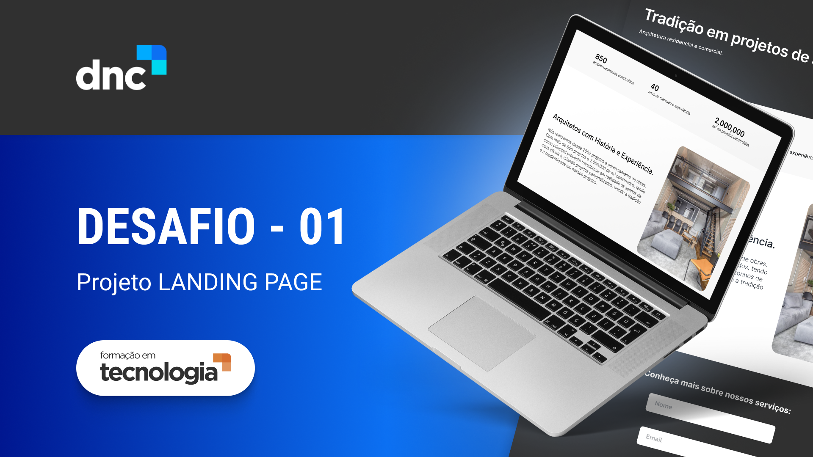

<h1 align="center"> Projeto Landing Page - Arquitetura </h1>

Boas-vindas ao projeto desenvolvido junto com a Escola DNC.

<a href="#-tecnologias">Tecnologias</a>&nbsp;&nbsp;&nbsp;|&nbsp;&nbsp;&nbsp;
<a href="#-projeto">Projeto</a>&nbsp;&nbsp;&nbsp;|&nbsp;&nbsp;&nbsp;
<a href="#-layout">Layout</a>&nbsp;&nbsp;&nbsp;

 

## 🚀 Tecnologias

Esse projeto foi desenvolvido com as seguintes tecnologias:

- HTML e CSS
- Git e Github
- Figma

## 💻 Projeto

A Landing Page foi desenvolvida para o desafio no módulo de introdução ao  
Desenvolvimento Web, do curso de Formação em Tecnologia da Escola DNC.  
Foi o primeiro desafio para os alunos desenvolver sozinhos utilizando os  
conhecimentos adquiridos durante o módulo.  

É um projeto básico com um conceito simples para iniciantes se familiarizar  
com as tecnologias citadas acima.

## 🔖 Layout

Você pode visualizar o projeto através dos links:

- [Landing Page](https://charming-travesseiro-7226f9.netlify.app/)
- [Planilha](https://docs.google.com/spreadsheets/d/1cCDtHftewZFEfOboysQsQ19zwJ3DuygqvyItIyAgHZo/edit?usp=sharing)
- [Layout no Figma](https://www.figma.com/file/lFGqjYvJPJZpus7P4LhXoV/Escola-DNC---DESAFIO-01?type=design&node-id=0-1&mode=design)